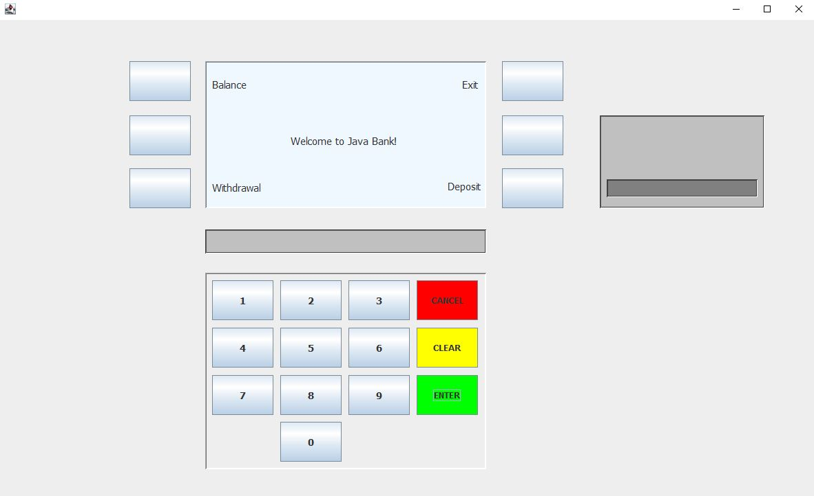
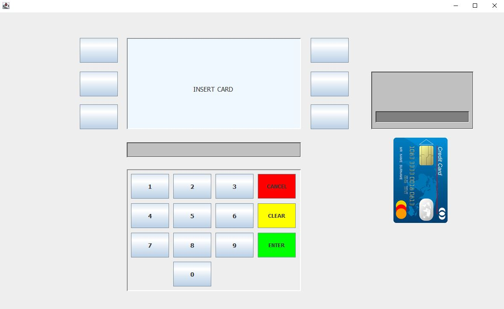

# ATM :credit_card:
This is an ATM simulator where users can view their account balance and withdraw or deposit money.
## About
The purpose of this Java Application was to learn the Java fundamentals as well as an introduction to Java GUI programming.
### How it works
After the card is inserted by clicking on it, the user has to introduce a PIN number. For this demo, the correct PIN numbers correspond to the initialized cards defined with the class Card. After pressing the Enter button the typed number from the text field is compared to the PIN numbers of each card from an array named cardsList. The account data associated to that PIN number is saved in a private variable called Account. The user can view the account balance and withdraw or deposit money. The withdrawal is possible only if the entered amount is smaller than the balance. After the user withdraws or deposits money the account balance will always update. 
## Demo
Check it out: https://youtu.be/PBaQbJRhR54
### Screenshots
 
